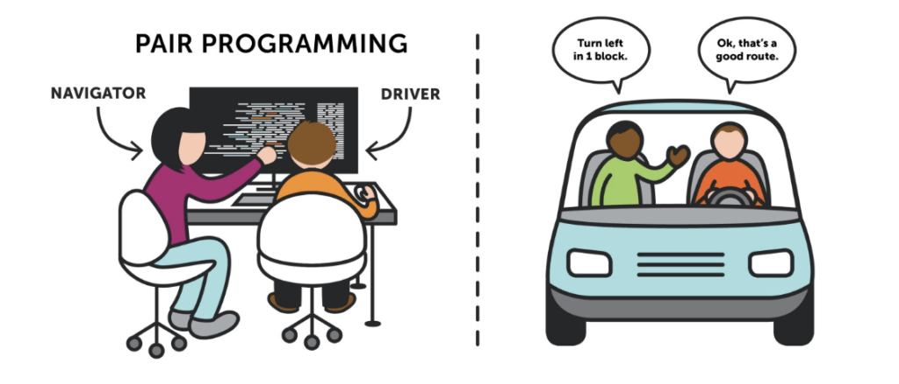
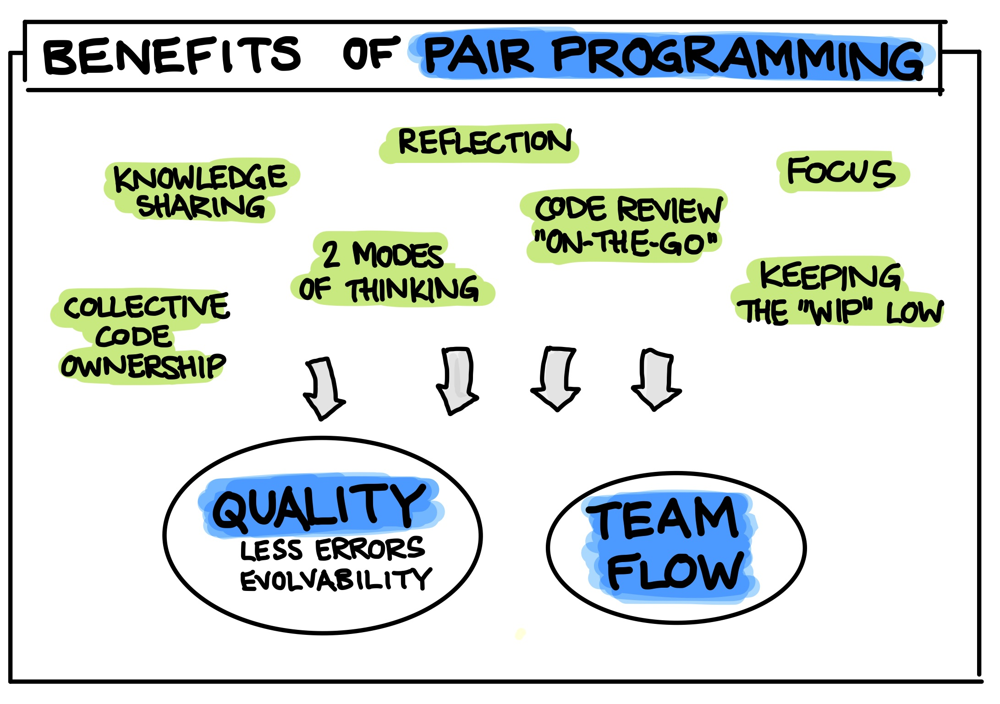

# Pair Programming Scenario



## Participants:
Driver: Alice
Navigator: Bob

## Task:
Create a JavaScript script that assigns a predefined list of numbers, calculates the average, and prints it, using basic code

## Initial Code Implementation

### Driver (Alice) starts coding:

```
// Basic code with predefined numbers to calculate the average

// Assign a predefined list of numbers
let numArray = [10, 20, 30, 40, 50];

// Calculate the sum using a basic loop
let sum = 0;
for (let i = 0; i < numArray.length; i++) {
    sum += numArray[i];
}

// Calculate the average
let average = sum / numArray.length;

// Print the average
console.log(`The average is: ${average}`);
```

## Navigator (Bob) suggests improvements:

**1.** 

**2.** 

<br/>

